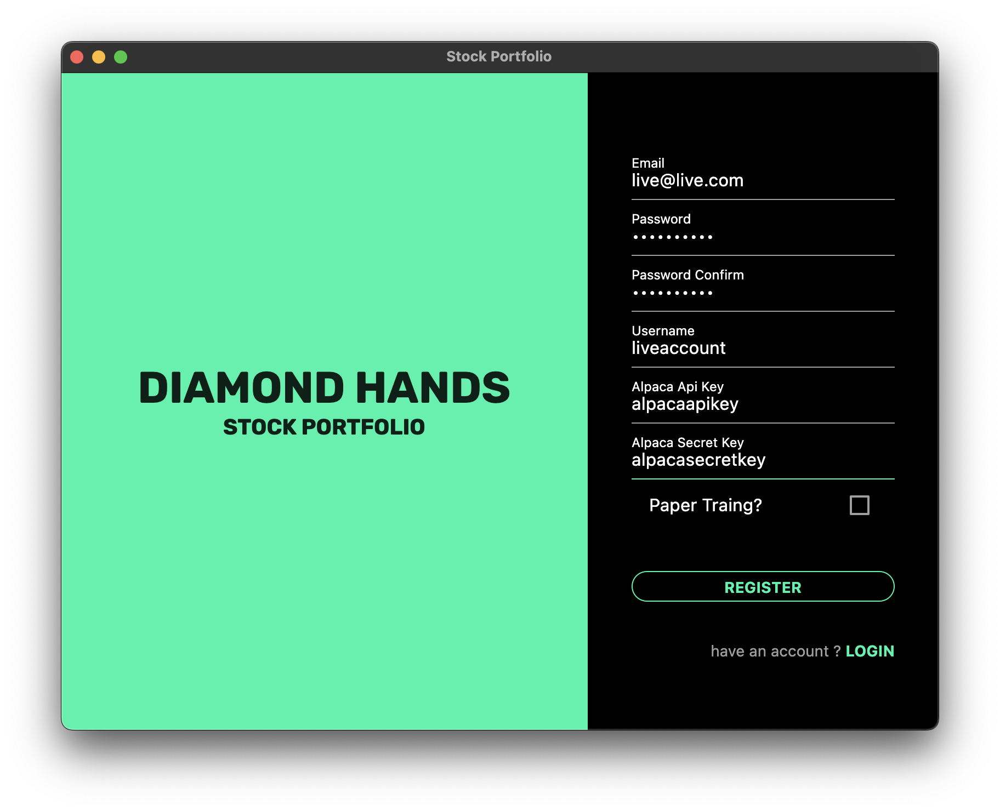
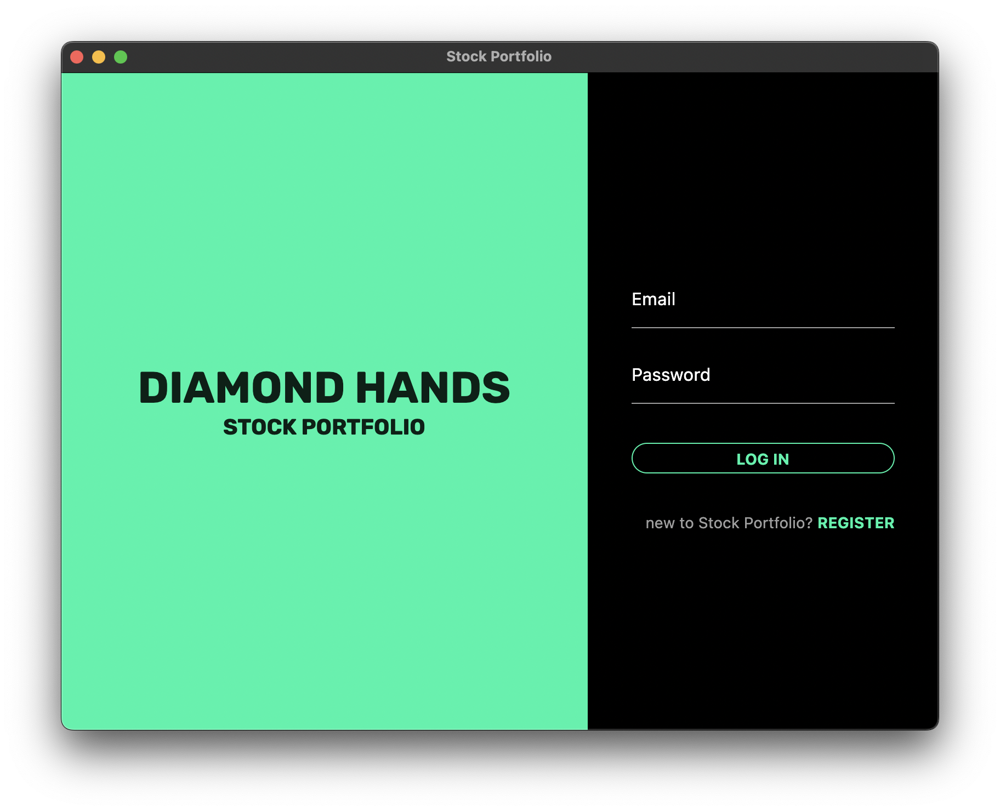
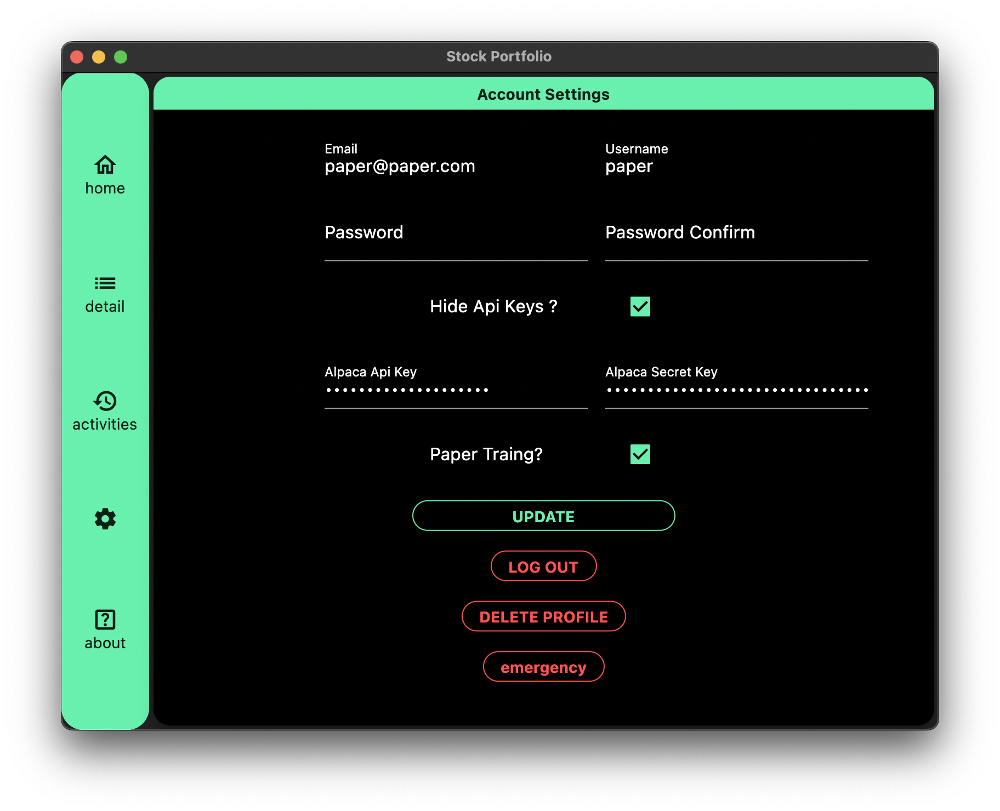
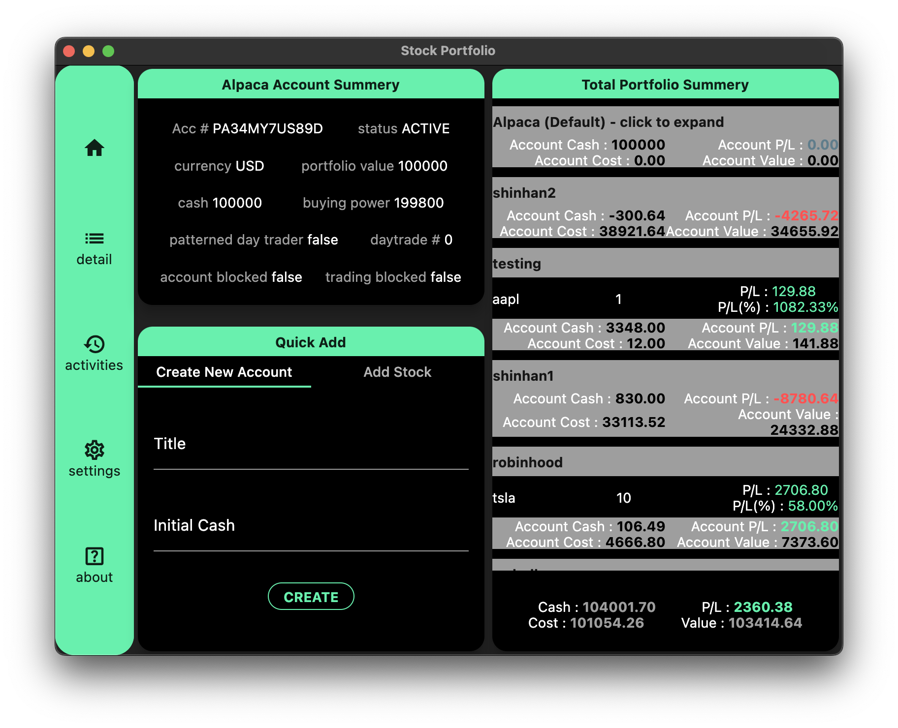
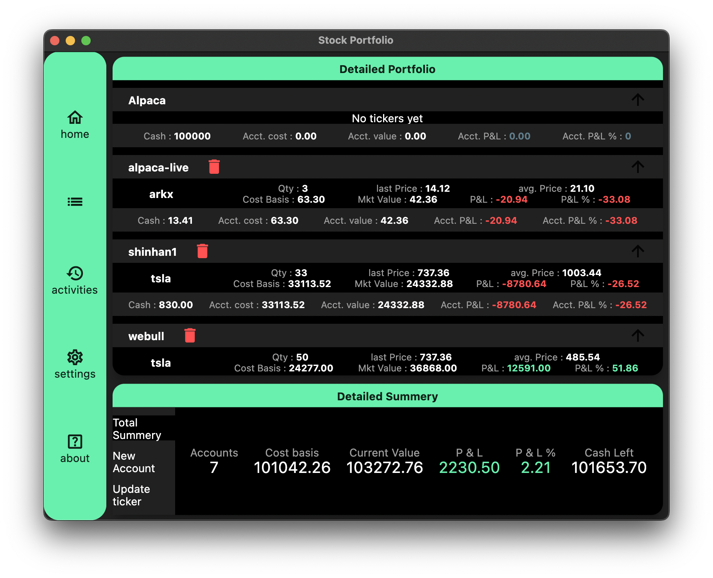
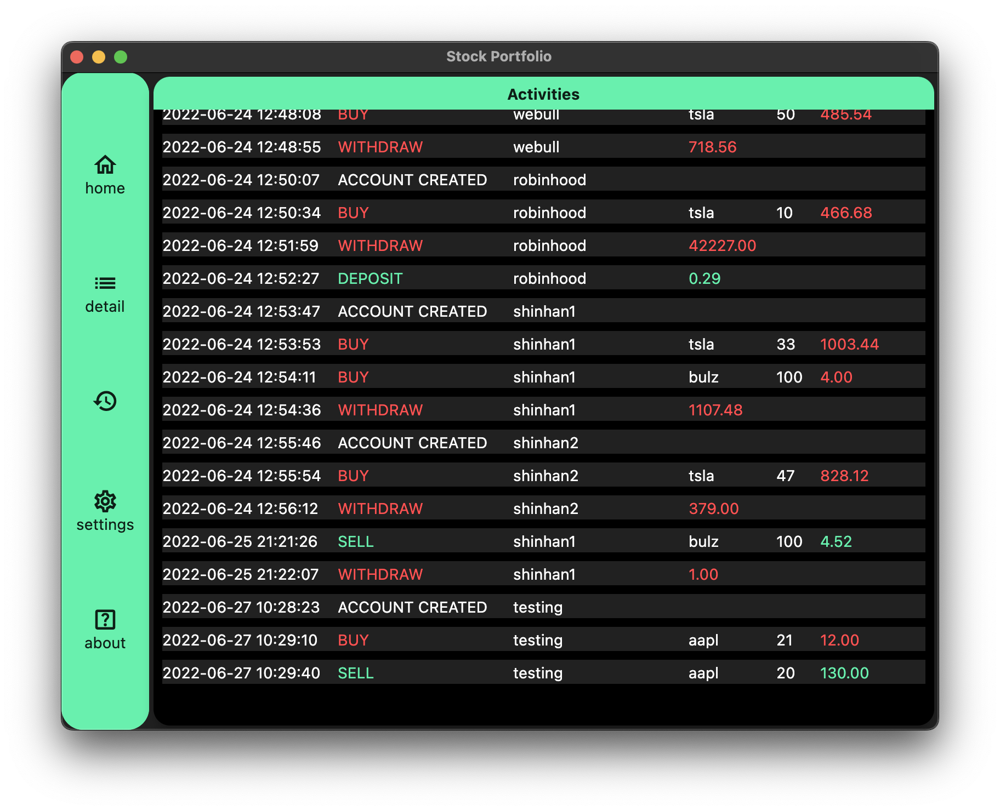

# DIAMOND HANDS : Stock Portfolio

## Demo | 시연영상

## Objectives | 개발 목표
  to create stock portfolio application that can keep track of all accounts in a single program
  
  여러 계좌에 흩어져 있는 미국 주식들을 한번에 보고 관리 할 수 있는 어플리케이션
 
## Requirements | 요구사항
  this program is built for MacOS
  
  맥 OS 용 어플리케이션입니다
  
  you will need Alpaca Market's account to obtaion API keys for accessing realtime stock data and provide them when registering
  
  실시간 미국 주식 데이터를 위해서 Alpaca Markets에서 제공하는 API Key가 필요합니다
  

## Dev Stacks | 개발 스택
  Frontend : Flutter
  
  Backend : Django Rest Framework
  
  Database : Mariadb
  
  Web Server : Nginx
  
  Deploy : Docker / Portainer
  
 ### Functionalities | 주요 기능
  - Profile | 계정
    - Profile Register | 회원 가입
      -  
    - Login | 로그인
      - 
    - Update | 계정 관리
      - 
  - Accounts | 계좌
    - Create Account | 새 계좌 만들기
    - Delete Account | 계좌 지우기
    - Add / Remove Stock | 주식 추가 / 제거
    - Deposit / Withdraw Cash | 현금 추가 / 제거
    - Get Simple Summery | 대쉬보드에서 간편 보기
      -  
    - Get Detailed Summery | 자세한 계좌 보기
      - 
  - Activities | 기록
    - Activity logs | 거래 기록
      - 
